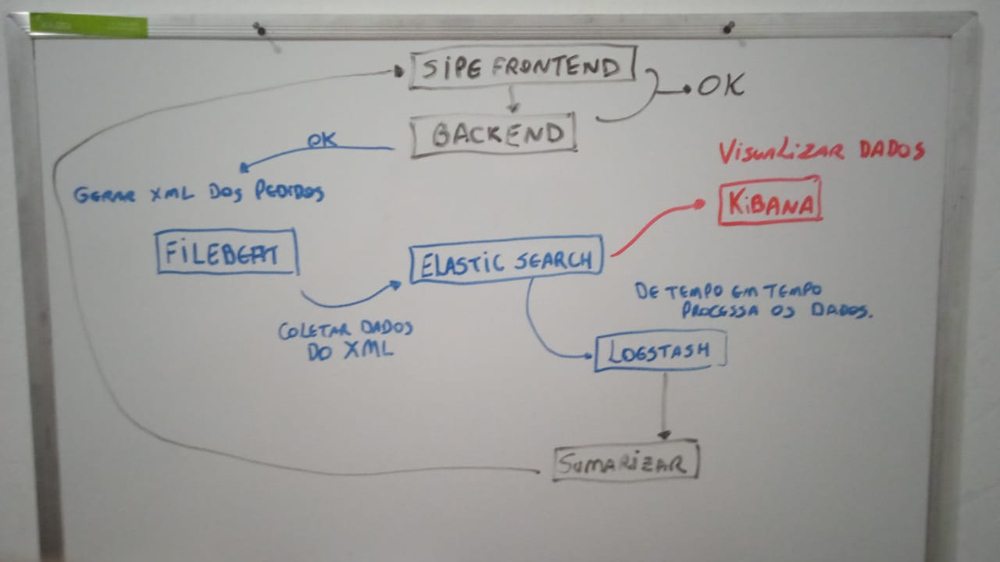

# Sipe - Sistema de Pedidos

Sistema de cadastros de produtos e geração de pedidos

## Subprojetos do Sistema

>Backend: Responsável por gerir informações para os usuários
Frontend: Responsável por mostrar os dados e permitir operações para os usuário
Gerador XML: Responsável por gerar os arquivos XML dos pedidos gerados
Elastic Stack: Mantém orientações de configuração da Stack
Docs: Centraliza os documentos que são usados globalmente no projeto

## Principais Tecnologias

```
Backend: NodeJS (Javascript)
Frontend: ReactJS (Javascript)
Gerador XML: Python
```

## Arquitetura do Projeto



#### Backend e Frontend
O Backend e o Frontend trabalham juntos para que o usuário consiga gerenciar os clientes, produtos, pedidos e usuários do sistema. Quando um pedido é gerado, um registro é adicionado na base de dados com o atributo **XML gerado** falso para que seja processado posteriormente.

#### Gerador XML
De tempos em tempos, o mecanismo de gerador de arquivos xml é executado, procurando na base de dados registros que estão com a flag XML gerado igual a falso.
Para cada um dos pedidos encontrado, o gerador criará um XML e quando der sucesso, atualizará a flag para verdadeiro (true), assim na próxima execução, esse pedido não cairá no processo.

#### Filebeat e Elasticsearch
o Filebeat fica monitorando o diretório onde esses XMLs são criados e quando encontra um ou mais arquivo, ele lê o conteúdo deles e insere dentro da base do Elasticsearch. O Elasticsearch cria os índices para esses registros e os mantém guardados.
O Filebeat só coleta dados de um arquivo específico apenas uma vez, pois ele tem um controle desses arquivos, para não enviar os dados do mesmo arquivo mais de uma vez.

